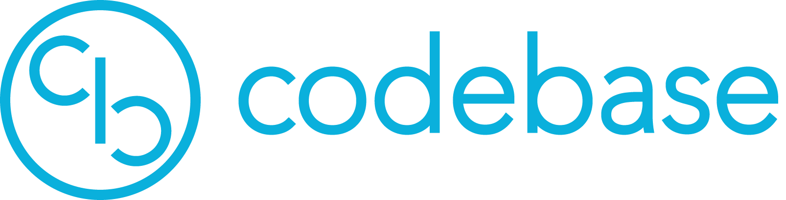

# Code Base

 

  

 

This repository is collection of solutions, notes and references which I use for revision and practice.

1. `notes`: Contains course notes and also my personal notes from various articles
2. `code`: Contains my solutions to various problems in competitions and coding platforms (hackerrank, leetcode, codeforces)

## Project Ideas

- [ ] Regex Engine from scratch

## Monthly Goals

**December**

- [ ] Complete 100 Problems in leetcode
- [ ] Complete a project (MLOps)
- [ ] write an article on a project (MLOps)
  - [ ] write a linkedIn post on the project

## References:

**Machine Learning**
http://ciml.info/
https://github.com/ossu/data-science

**General**
https://teachyourselfcs.com/#programming
https://missing.csail.mit.edu/
