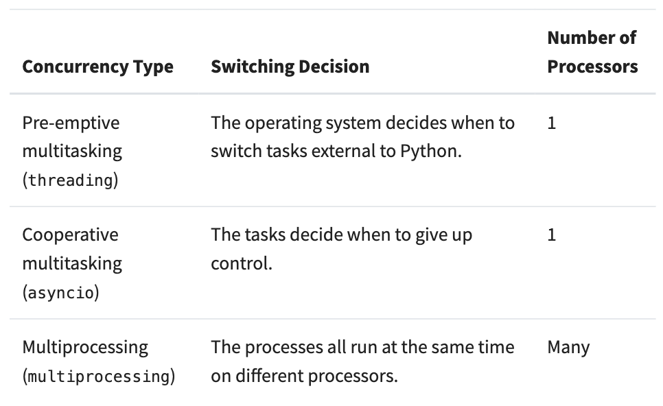
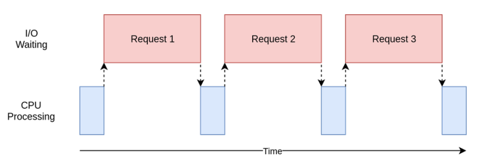

<h1 style='font-weight:bold' align="center">Concurrency in Python</h1>

<h3 align="center"><i>"This is my notes about concurrency from this amazing <a href="https://realpython.com/python-concurrency/">article</a> in realpython.com. I would highly recommend to read the article."</i></h3><br/>

If you have heard about concurrency but never really understood the clear meaning of it from a programming standpoint, then I recommend you to continue reading till the end.

In literal meaning concurrency means two or more events or circumstances happening at the same time. In python there various names for concurrency such as `threading`, `asynchronous (asyncio)` and `multiprocessing`.

Before we unwrap the meaning of each of these terms, we need should know what is being computed. When a program is executed, the processor executes a set of sequential instructions one after the other. This set of instructions is called a `thread`.

Sometimes, `thread` is also referred as `process` or `task`.

When a CPU running only one thread at a time, it is said to be `single threaded`. This is place at which concurrency plays an important role. Concurrency improves the performance of the process by a lot by running multiple threads simultaneously.

Only `Multiprocessing` actually runs multiple threads at literally the same time.

Whereas `threading` and `asyncio` runs only on a single processor and one at a time. These improve the performance of the process by cleverly taking turns and the key difference between `threading` and `asyncio` is the way they take turns.

In `threading`, the OS actually knows about each thread and interrpts it at any time to start running a different thread. This is called **pre-emptive multitasking** since the OS can pre-empt the thread to make the switch.

On the other hand, `asyncio` uses **cooperative multitasking**. The tasks must cooperate by announcing when to switch with additional code unlike pre-emptive multitasking.

<br />

<h2 style="font-weight:bold">Introducing Parallelism</h2>

Each thread is run by a core in the CPU and when the CPU have multiple cores, we could run multiple processing at the same time using these cores. This is basically `multiprocessing`.

<p>
    
</p>
<br/>

<h2 style="font-weight:bold">What problem does concurrency solves?</h2>

There are two kinds of problem that occurs in the process. These are called `CPU-bound` and `I/O-bound`.

`I/O-bound` problems occur when the CPU is working with an external system which works at a much slower pace than the CPU. For example, when the CPU trying fetch data from a web server for some processing.

<p>
    
</p>

On the flip side, there are programs which completely rely on the CPU for processing hence the performance of the process is limited by the CPU. This is called `CPU-bound` problems.

<br/>

<h2 style="font-weight:bold">Speeding Up an I/O-bound programs</h2>

Lets take the following example in which we download the websites from the web server and calculate the time taken in the synchronous version (single threaded).

```python
import requests
import time

def synchronous_func():

    def download_site(url, session):
        with session.get(url) as response:
            print(f"Read {len(response.content)} from {url}")

    def download_all_sites(sites: list):
        with requests.Session() as session:
            for url in sites:
                download_site(url, session)

    sites = [
        "https://www.jython.org",
        "http://olympus.realpython.org/dice",
    ] * 80
    start_time = time.time()
    download_all_sites(sites)
    duration = time.time() - start_time
    print(f"Downloaded {len(sites)} in {duration} seconds")

'''
Output:

There could be some variations in the duration. When I tried the duration to download 126 sites it took about 30.004 seconds.

'''
```

<h3 style="font-weight:bold">
    About the functions:
</h3>

1. We are using `Session` object from requests instead of `get` directly because creating a session object allows requests to do some fancy networking tricks and speed up the process.

It can be clearly seen that the program takes a long time.

**NOTE:** If the program already takes very little time and is not executed at high frequency, it is not worth adding concurrency.

<h2 style="font-weight:bold">
   Threading Version
</h2>

```python
def threading_func(num_workers):

    import concurrent.futures
    import threading

    thread_local = threading.local()

    def get_session():
        if not hasattr(thread_local, "session"):
            thread_local.session = requests.Session()

        return thread_local.session

    def download_site(url):
        session = get_session()
        with session.get(url) as response:
            # print(f"Read {len(response.content)} from {url}")
            pass

    def download_all_sites(sites):

        with concurrent.futures.ThreadPoolExecutor(max_workers=num_workers) as executor:
            executor.map(download_site, sites)

    sites = [
        "https://www.jython.org",
        "http://olympus.realpython.org/dice",
    ] * 80

    start_time = time.time()
    download_all_sites(sites)
    duration = time.time() - start_time

    print(
        f"With {num_workers} workers: Downloaded {len(sites)} in {duration} seconds")
```

When `threading` is added the entire structure remains almost the same with very few changes.

<h3 style="font-weight:bold">
   Things-To-Note:
</h3>

- `ThreadPoolExecutor` = `Thread` + `Pool` + `Executor`
- We already know what `thread` is, the `pool` is an object which creates a collection of `threads`, each of which can run concurrently.
- Finally, `executor` is the part that controls the execution flow of the `threads`.
- `ThreadPoolExecutor` has a very handy method called `map()` which takes in the function and the list of parameters and automatically runs them concurrently.

<h3 style="font-weight:bold;font-size:25px;color:darkred">Caution !!</h3>

There is significant issue with `threading`. Because the OS is in control of the task, any data that is shared between the threads needs to be protected, or **thread-safe**.

Unfortunately, `requests.Session()` is not thread-safe.

<h3 style="font-weight:bold;font-size:25px;color:darkgreen">So how do we solve this problem?</h3>

1. One of the way we could solve this problem is using thread-safe data structures like `Queue` from Python's `queue` module.

   These objects use loe-level primitives like `threading.Lock` to ensure that only one thread can access a block of code or a bit of memory at the same time.

2. Thread Local Storage. `threading.local()` creates an object that looks like a global but is specific to each individual thread.

On a final note, choosing number of threads is mostly based on experimentation.

<br/>

<h2 style="font-weight:bold">
   Asyncio Version
</h2>
