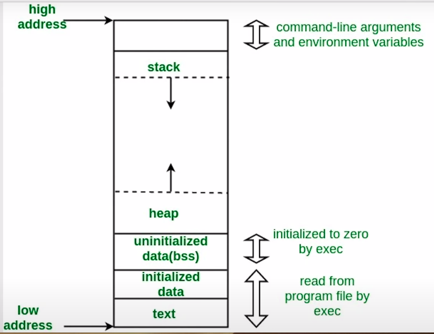

<h1 style="font-weight:bold" align="center">
Memory Allocation and management in python
</h1>

When a variable is declared, for example `x=10` and `x=y` both have the same value memory, i.e both variable points to the same object. Python optimizes memory utilisation by allocating the same obect reference to a new variable if object already exists in memory with same value.

Memory address stored by a variable can be found using `id()`.

The order of memory allocation in RAM is as follows (Low to high),

    

Heap is responsible to store all the values. A stack stores hold the references to the objects in the heap.

The name `heap` and `stack` does not have any relation to the data structure.